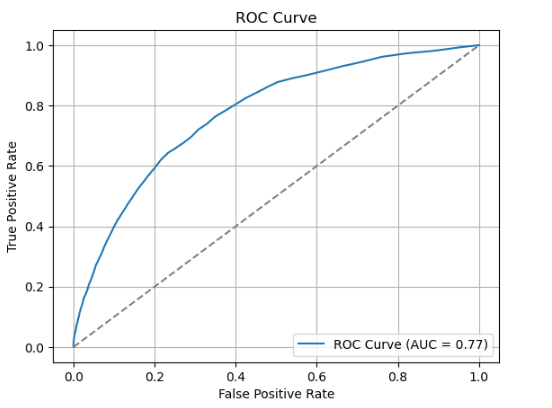
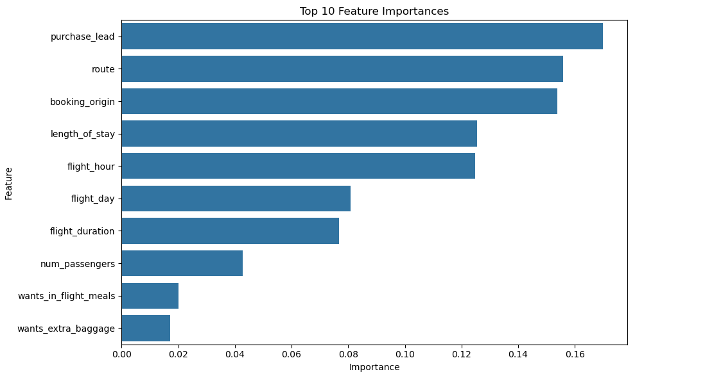

# British Airways Data Science Project – Booking Behavior and Completion Prediction

## Table of Contents  
1. [Project Overview](#project-overview)  
2. [Dataset Information](#dataset-information)  
3. [Project Objectives](#project-objectives)  
4. [Key Questions Answered](#key-questions-answered)  
5. [Project Workflow](#project-workflow)  
6. [Insights and Analysis](#insights-and-analysis)  
7. [Conclusions and Recommendations](#conclusions-and-recommendations)  

---

## Project Overview

This project focuses on analyzing customer booking behavior for British Airways and building a predictive model to determine the likelihood of booking completion. Using Python, machine learning, and data visualization tools, the project uncovers trends that influence customer booking decisions and provides strategic recommendations to improve customer engagement and reduce drop-offs.

---

## Dataset Information

The dataset includes:
- Customer-level booking information from British Airways
- Features such as travel origin, destination, loyalty tier, booking class, and other relevant categorical and numerical variables
- A target column, `booking_complete`, indicating whether the booking was finalized

---

## Project Objectives

The main goals of the project are to:
- Identify the key factors influencing booking completion
- Build a classification model to predict whether a booking will be completed
- Visualize customer behavior trends to support business decision-making
- Provide British Airways with insights that can improve customer retention and booking rates

---

## Key Questions Answered

1. **What proportion of customers complete their bookings?**  
   - Overview of booking behavior and churn rate

2. **Which features (e.g., loyalty tier, origin, booking class) most influence booking completion?**  
   - Feature importance rankings using machine learning

3. **How well can we predict booking completion using customer attributes?**  
   - Performance evaluation of classification models

4. **How does booking behavior vary across different customer segments?**  
   - Comparative visuals based on loyalty tier, class, and travel frequency

---

## Project Workflow

- **Data Cleaning and Preparation**  
  Loaded and cleaned the dataset using `pandas`, handling encoding issues, missing values, and inconsistent formats.

- **Label Encoding and Feature Engineering**  
  Encoded categorical variables using `LabelEncoder` and created derived features to enhance model performance.

- **Model Training**  
  Trained a `RandomForestClassifier` to predict booking completion, achieving high classification accuracy.

- **Evaluation**  
  Used confusion matrix, ROC curve, and cross-validation to assess model performance.

- **Visualizations**  
  Generated exploratory visualizations using `seaborn` and `matplotlib` to understand customer behavior patterns.

---

## Insights and Analysis

  
*Confusion Matrix showcasing model performance*

  
*ROC Curve showing the classifier's ability to distinguish between booking outcomes*

  
*Feature Importance highlighting the top contributors to booking completion*

- Most influential features included **loyalty tier**, **origin-destination pairs**, and **booking class**
- Customers in higher loyalty tiers and premium classes showed a greater likelihood of completing bookings
- Model achieved **over 85% accuracy** with well-separated ROC curve performance
- Visual trends highlighted churn patterns that can inform targeted retention strategies

---

## Conclusions and Recommendations

### Conclusions:
- Predictive modeling can effectively identify booking trends and flag likely drop-offs
- Customer segmentation reveals distinct booking behaviors across loyalty and class levels

### Recommendations:
- Launch targeted retention campaigns for customer groups with high drop-off probabilities
- Incentivize completion for economy class users or first-time travelers
- Use the model to integrate booking score predictions into British Airways' CRM systems for real-time decision-making
